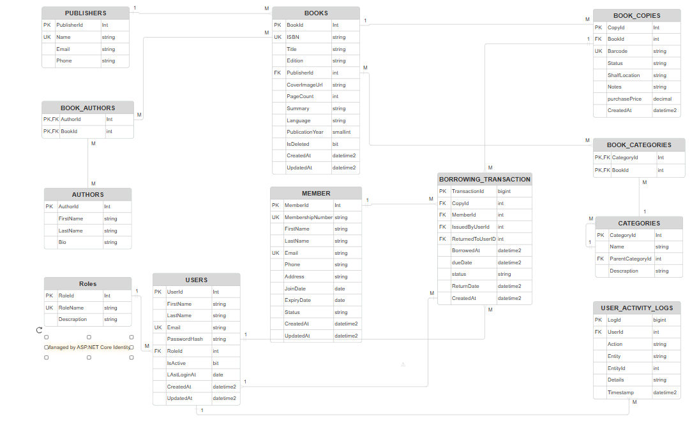

# Library Management System

A RESTful API for managing books, members, borrowing transactions, and
library staff users.

## Tech Stack

- ASP.NET Core 8
- Entity Framework Core
- SQL Server
- ASP.NET Core Identity
- JWT Authentication
- Swagger

## Architecture

I chose a simple N-Tier architecture because it is suitable for the scope and requirements of this project. If the system grows and requires more separation between business logic and data access, Repository and Unit of Work patterns could be introduced. For a larger and more complex system, the architecture could further evolve toward Clean Architecture to provide stronger separation of concerns and better testability.

- **Controllers** – Handle HTTP requests and responses.
- **Services** – Contain the business logic.
- **EF Core / DbContext** – Handles database access.
- **DTOs** – Used for API requests and responses instead of exposing entities.
- **Middleware** – Handles exceptions globally.
- **Identity & JWT** – Handle authentication and role-based authorization.

## Design Decisions

### Books and Book Copies

A `Book` represents the book itself and contains metadata such as title,
ISBN, publisher, authors, and categories.

A `BookCopy` represents a physical copy of that book and contains its
barcode and current status.

This allows the library to have multiple copies of the same book, with each
copy being independently available or borrowed.

### Borrowing

Borrowing is performed using a specific `BookCopy` rather than only a
`Book`.

When a copy is borrowed, its status changes to `Borrowed`. When it is
returned, the status changes back to `Available`.

### Categories

Categories support a hierarchy through `ParentCategoryId`.

For example:

Fiction
- Fantasy
- Mystery

### Authentication and Authorization

ASP.NET Core Identity is used for user management and password hashing.

JWT is used for API authentication.

The system has three roles:

- Administrator
- Librarian
- Staff

Role-based authorization is applied to the API endpoints according to the
responsibilities of each role.

### Activity Logging

Important operations such as creating and updating records, borrowing, and
returning books are recorded in `UserActivityLogs`.

The logging logic is centralized in `IActivityLogService` instead of being
duplicated across services.

### Soft Delete

Books use an `IsDeleted` flag so that they can be removed from normal queries
without removing their historical data.

Members are deactivated using their status instead of being physically
deleted.

### DTOs

DTOs are used to control what the API accepts and returns. They also allow
the API to return data from related entities without exposing the database
entities directly.

## API Overview

| Area | Main Endpoints |
|---|---|
| Authentication | `POST /api/auth/login` |
| Books | `GET /api/books`, `POST /api/books`, `PUT /api/books/{id}` |
| Book Copies | `POST /api/bookcopies`, `GET /api/bookcopies/book/{bookId}` |
| Members | `GET /api/members`, `POST /api/members`, `PUT /api/members/{id}` |
| Borrowing | `POST /api/borrowing/borrow`, `POST /api/borrowing/{id}/return` |
| Users | `GET /api/users`, `POST /api/users` |
| Categories | `GET /api/categories`, `POST /api/categories` |
| Activity Logs | `GET /api/activitylogs` |

## Error Handling

The application uses a global exception-handling middleware.

Services throw specific exceptions such as `NotFoundException` and
`ConflictException`. The middleware converts these exceptions into the
appropriate HTTP responses, keeping controllers simple.

## Database Design

Main Relationships

Book → BookCopies: 1-to-Many — a book represents a title and can have multiple physical copies, while each physical copy belongs to one specific book.

Book ↔ Authors: Many-to-Many — a book can have multiple authors, and an author can write multiple books. This relationship is handled through the BookAuthor junction table.

Book ↔ Categories: Many-to-Many — a book can belong to multiple categories, and a category can contain multiple books. This relationship is handled through the BookCategory junction table.

Publisher → Books: 1-to-Many — a publisher can publish multiple books, while each book is associated with one publisher.

Member → BorrowingTransactions: 1-to-Many — a member can have multiple borrowing transactions over time, while each borrowing transaction belongs to one member.

BookCopy → BorrowingTransactions: 1-to-Many — a physical book copy can be involved in multiple borrowing transactions over its lifetime, while each borrowing transaction refers to one specific copy.

ApplicationUser → ActivityLogs: 1-to-Many — a system user can perform multiple actions that are recorded in the activity log, while each activity log entry belongs to the user who performed that action.

### ERD

## SQL Scripts

The complete database schema and sample data script is included in the `SQL` folder:

- [Database Script with Sample Data](SQL/LibraryManagementSystem.sql)
